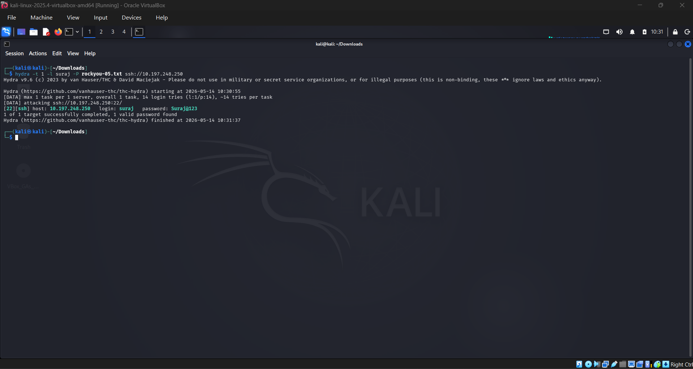
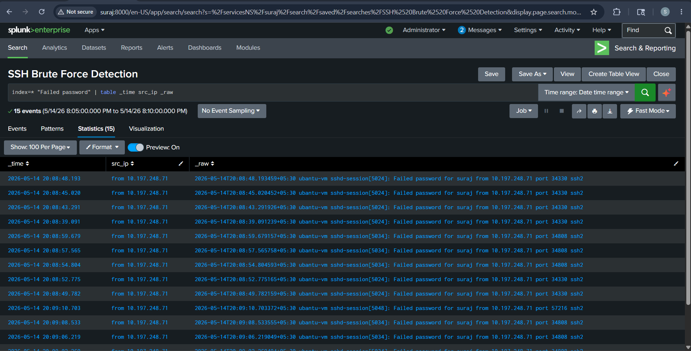
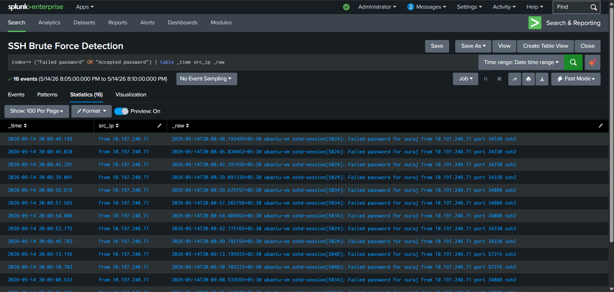
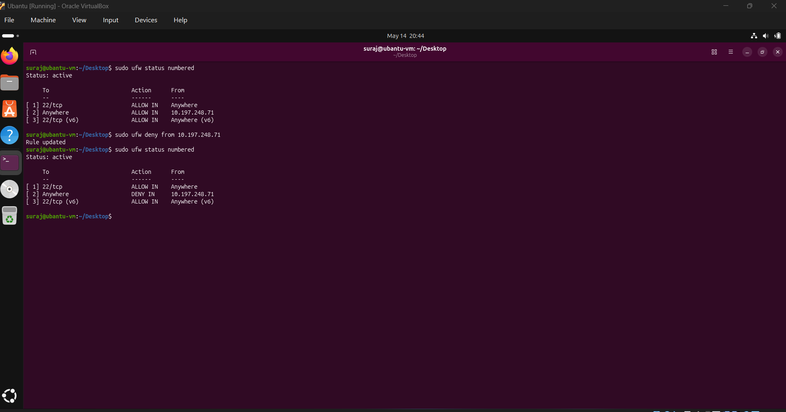

# Splunk SSH Brute Force Detection Lab
SOC home lab project demonstrating SSH brute-force detection, Splunk alerting, log analysis, incident response triage, and containment using Kali Linux, Ubuntu, and Splunk Enterprise.


## Overview

This project demonstrates a hands-on SOC (Security Operations Center) home lab focused on SSH brute-force detection, alerting, investigation, and incident response using Splunk Enterprise.

The lab simulates a brute-force attack from Kali Linux against an Ubuntu VM. Authentication logs from Ubuntu were forwarded to Splunk Enterprise using Splunk Universal Forwarder, where detection rules and alerts were created to identify suspicious SSH activity.

After the attack was detected, alert triage and incident response steps were performed to investigate and contain the attack.

---

## Lab Environment

### Host System
- Windows 11 Home

### Virtual Machines
- Kali Linux VM (Attacker)
- Ubuntu VM (Victim)

### SIEM & Log Collection
- Splunk Enterprise installed on Windows 11
- Splunk Universal Forwarder installed on Ubuntu

---

## Lab Architecture

Kali Linux (Attacker)
↓
Ubuntu VM (Victim + SSH Logs)
↓
Splunk Universal Forwarder
↓
Splunk Enterprise on Windows 11

---

## Configuration Performed

### Ubuntu VM
- Installed and enabled SSH service
- Enabled TCP port 22 for SSH communication through UFW
- Installed Splunk Universal Forwarder
- Configured log forwarding to Splunk Enterprise

### Windows Host
- Installed Splunk Enterprise
- Configured Splunk to receive forwarded logs
- Allowed required TCP communication through Windows Firewall

### Kali Linux VM
- Installed Hydra password attack tool
- Downloaded password wordlist for brute-force simulation

---

## Attack Simulation



Hydra was used from the Kali Linux VM to simulate an SSH brute-force attack against the Ubuntu VM.

Example command used:

```bash
hydra -l <username> -P passwords.txt ssh://<victim-ip>
```

The password list contained multiple incorrect passwords and one valid password to simulate successful compromise after repeated failed attempts.

---

## Detection Engineering

A Splunk detection rule and alert were created to identify repeated SSH failed login attempts.

### Detection Logic
- Detect multiple failed SSH login attempts from same IP
- Identify brute-force behavior based on threshold
- Generate alert when threshold exceeded

### Example SPL Query

```spl
index=* "Failed password"
| rex "from (?<src_ip>\d+\.\d+\.\d+\.\d+)"
| stats count by src_ip
| where count > 5
```

---

## Alert Triage Performed



After the alert triggered in Splunk, investigation and triage steps were performed.

### Findings
- Multiple failed login attempts observed
- Attack originated from same IP address
- SSH service was targeted
- Attack frequency occurred within seconds
- Automated brute-force behavior identified
- Successful login detected after failed attempts
- Alert confirmed as True Positive



---

## Incident Response Actions

### Containment
- Blocked attacker IP address using firewall rules

- Verified that attack activity stopped

### Investigation
- Reviewed raw authentication logs
- Correlated failed and successful login events
- Investigated attack timeline and login activity

---

## Challenges Faced

### Duplicate Alert Triggering
Initially, the alert triggered repeatedly because:
- alert schedule was configured incorrectly
- old logs were repeatedly searched
- throttling was not configured

### Fix Applied
- Updated alert search time window
- Matched alert schedule with search duration
- Configured proper throttling settings

---

## Skills Demonstrated

- Splunk SIEM
- Ubuntu Log Analysis
- Splunk Universal Forwarder
- Detection Engineering
- Alert Triage
- Incident Response Workflow
- SSH Brute Force Detection
- SPL Query Writing
- Firewall Containment
- SOC Investigation Workflow

---

## Tools Used

- Splunk Enterprise
- Splunk Universal Forwarder
- Kali Linux
- Ubuntu Linux
- Hydra
- UFW Firewall

---

## Learning Outcomes

This project helped develop practical understanding of:
- SIEM alerting workflow
- Detection rule creation
- Alert tuning and throttling
- SSH brute-force attack behavior
- SOC alert triage process
- Basic incident response lifecycle
- Log investigation techniques
